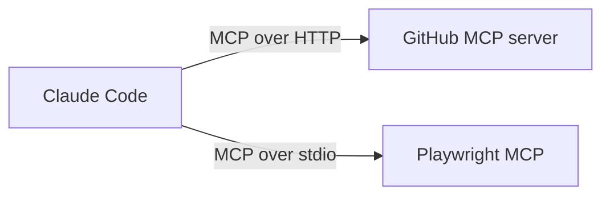

[Claude Code](entry:claude-code) speaks the [Model Context Protocol](entry:model-context-protocol), so any MCP server can give it new tools.



## 1. Add a remote server

The [GitHub MCP server](entry:github-mcp-server) is hosted, so you register its URL:

```bash
claude mcp add --transport http github https://api.githubcopilot.com/mcp/
```

## 2. Add a local server

[Playwright MCP](entry:playwright-mcp) runs on your machine through `npx`:

```bash
claude mcp add playwright npx @playwright/mcp@latest
```

## 3. Check

| Command | What it does |
|---|---|
| `claude mcp list` | Lists configured servers |
| `/mcp` (inside a session) | Shows status and handles sign-in |
