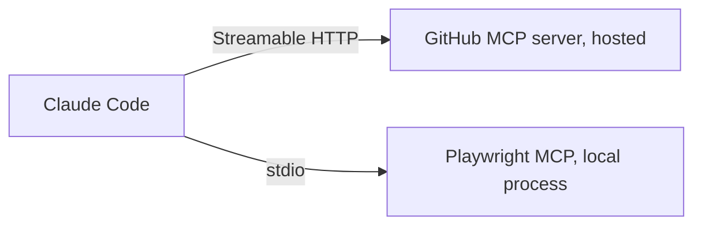

[Claude Code](entry:claude-code) is an MCP client, so any [Model Context Protocol](entry:model-context-protocol) server can give it new tools. There are two kinds:



- **Remote servers** run somewhere else and are reached over HTTP. You register a URL.
- **Local servers** run as a process on your machine, and Claude Code talks to them over stdin and stdout. You register a launch command.

## 1. Add a remote server

The hosted [GitHub MCP server](entry:github-mcp-server) lives at `https://api.githubcopilot.com/mcp`. With Claude Code, GitHub's own install guide authenticates it with a personal access token sent as a header:

```bash
claude mcp add --transport http github https://api.githubcopilot.com/mcp \
  --header "Authorization: Bearer $GITHUB_PAT"
```

Servers that support OAuth need no header. Add them by URL, then sign in from inside a session with `/mcp` (or `claude mcp login <name>`; add `--no-browser` over SSH):

```bash
claude mcp add --transport http notion https://mcp.notion.com/mcp
```

Use `--transport http`. The older SSE transport is deprecated, and recent Claude Code versions fall back to it automatically when a server only speaks SSE.

## 2. Add a local server

[Playwright MCP](entry:playwright-mcp) runs on your machine through `npx`. Put the launch command after `--`, so flags such as `-y` go to the server command instead of being read as Claude Code options:

```bash
claude mcp add playwright -- npx @playwright/mcp@latest
```

Pass environment variables with `--env` (or `-e`). Put another option, such as `--transport stdio`, between the last `--env` pair and the server name; otherwise the CLI reads the name as one more `KEY=value` pair and rejects it:

```bash
claude mcp add --env API_KEY=your-key --transport stdio example -- npx -y @example/mcp-server
```

## 3. Pick a scope

Every `claude mcp add` takes `--scope` (or `-s`):

| Scope | Stored in | Who gets it |
|---|---|---|
| `local` (default) | `~/.claude.json`, under the current project's path | Only you, only in this project |
| `project` | `.mcp.json` at the repository root | Everyone who clones the repo |
| `user` | `~/.claude.json` | Only you, in every project |

Older guides call these `project` and `global`; GitHub's install guide notes that `local` used to be called `project` and `user` used to be called `global`.

## 4. Keep secrets out of shared config

A header passed on the command line is saved in the config file. For a project-scoped server that would put your token in `.mcp.json`, which gets committed. Instead, reference an environment variable; Claude Code expands `${VAR}` and `${VAR:-default}` in `command`, `args`, `env`, `url` and `headers`:

```json
{
  "mcpServers": {
    "github": {
      "type": "http",
      "url": "https://api.githubcopilot.com/mcp",
      "headers": {
        "Authorization": "Bearer ${GITHUB_PAT}"
      }
    }
  }
}
```

In JSON, always set `"type"`. A `url` without a type is an error, and `streamable-http` is accepted as an alias for `http`.

Project-scoped servers ask for approval the first time you open the project interactively. They load **without** asking in `claude -p` runs, Agent SDK sessions and cloud sessions, so review `.mcp.json` in any repository before you run Claude Code on it unattended, or start with `--strict-mcp-config` and pass only the servers you want with `--mcp-config`.

## 5. Check that it worked

| Command | What it does |
|---|---|
| `claude mcp list` | Lists servers with a status such as `✔ Connected`, `! Needs authentication` or `✘ Failed to connect` |
| `claude mcp get <name>` | Shows one server's configuration and, on failure, an `Issue:` line with the HTTP status or error |
| `/mcp` (inside a session) | Shows status and handles OAuth sign-in |
| `claude mcp remove <name>` | Removes a server |

Two limits are worth knowing. Server startup times out after a default you can change with `MCP_TIMEOUT` (in milliseconds), and Claude Code warns when one tool result exceeds 10,000 tokens and cuts it off at 25,000 by default (`MAX_MCP_OUTPUT_TOKENS` raises the cap).

For connecting other clients (Codex, Cursor, Gemini CLI, VS Code) and for how remote MCP authorization works under the hood, see [Connect an agent to a remote MCP server](guide:connect-an-agent-to-a-remote-mcp-server).
