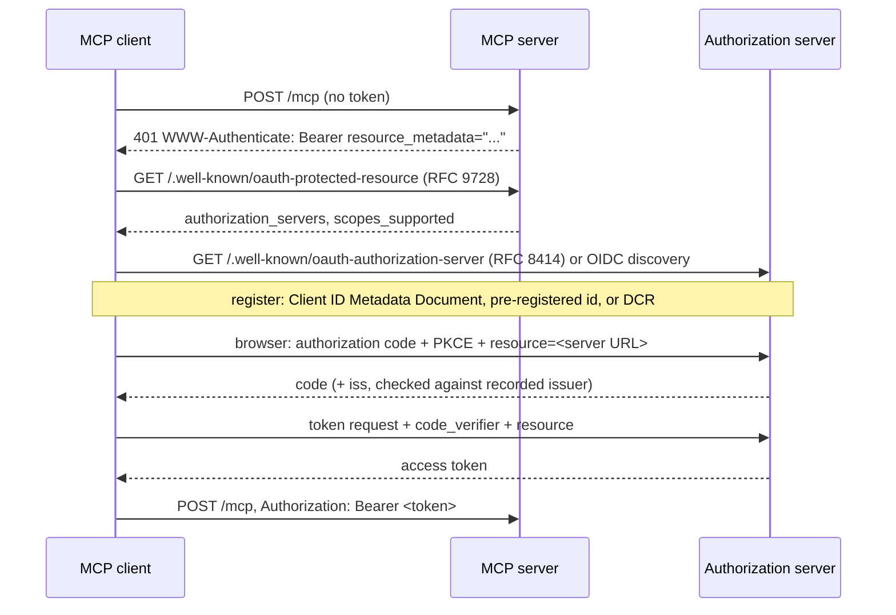

A **remote** MCP server is an MCP server you reach at a URL, such as `https://mcp.notion.com/mcp`, instead of a process your client launches. You don't install anything locally, every client can share it, and sign-in usually goes through OAuth in a browser. This guide covers what happens on the wire, how authorization is discovered, and the exact configuration for the major clients.

If you only need Claude Code commands, see [Add MCP servers to Claude Code](guide:add-mcp-servers-to-claude-code).

## Know which spec version you are dealing with

The [MCP specification](entry:model-context-protocol)'s current version is **2026-07-28**, and it changed remote MCP a lot compared with **2025-11-25**:

| | 2025-03-26 to 2025-11-25 ("legacy") | 2026-07-28 ("modern") |
|---|---|---|
| Handshake | `initialize` + `notifications/initialized` | None. Every request carries its version and capabilities in `_meta` |
| Sessions | Optional `Mcp-Session-Id` header | Removed. Servers keep state in explicit handles passed as tool arguments |
| Server-to-client stream | `GET` on the endpoint opens SSE | Removed. `subscriptions/listen` instead |
| Server asking the client for input | Server sends requests (sampling, elicitation) | Returns `InputRequiredResult`, and the client retries with `inputResponses` |
| Required HTTP headers | `MCP-Protocol-Version` (since 2025-06-18) | `MCP-Protocol-Version`, `Mcp-Method`, `Mcp-Name` |
| Discovery | `initialize` result | Mandatory `server/discover` RPC |

The spec also now deprecates Roots, Sampling, Logging, the old HTTP+SSE transport and OAuth Dynamic Client Registration (in favor of Client ID Metadata Documents).

In practice both eras are live today. On 2026-10-02, a `server/discover` request to Context7's endpoint succeeded with `supportedVersions: ["2026-07-28"]`, and the same server still answered a legacy `initialize`. DeepWiki's endpoint rejected 2026-07-28 and listed `2024-11-05, 2025-03-26, 2025-06-18, 2025-11-25`. Clients are expected to negotiate. The spec's backward-compatibility rule: try a modern request first, and if you get `400` with no recognized modern JSON-RPC error in the body, fall back to `initialize`.

## The transport: Streamable HTTP

The server exposes **one endpoint** that accepts `POST`. Each JSON-RPC message is its own POST, and the server replies with either a single `application/json` object or a short `text/event-stream` (SSE) stream scoped to that request, so clients must handle both. The client must send `Accept: application/json, text/event-stream`.

You can try this with curl. A modern request looks like this:

```bash
curl -s https://mcp.context7.com/mcp \
  -H 'content-type: application/json' \
  -H 'accept: application/json, text/event-stream' \
  -H 'MCP-Protocol-Version: 2026-07-28' \
  -H 'Mcp-Method: server/discover' \
  -d '{"jsonrpc":"2.0","id":1,"method":"server/discover","params":{"_meta":{"io.modelcontextprotocol/protocolVersion":"2026-07-28","io.modelcontextprotocol/clientCapabilities":{}}}}' | jq .
```

A legacy handshake looks like this:

```bash
curl -s https://mcp.deepwiki.com/mcp \
  -H 'content-type: application/json' \
  -H 'accept: application/json, text/event-stream' \
  -d '{"jsonrpc":"2.0","id":1,"method":"initialize","params":{"protocolVersion":"2025-11-25","capabilities":{},"clientInfo":{"name":"curl","version":"0"}}}'
```

Errors worth recognizing:

| Response | Meaning |
|---|---|
| `400` + JSON-RPC `-32022` (UnsupportedProtocolVersion) | Retry with a version from the `supported` list |
| `400` + `-32020` (HeaderMismatch) | `MCP-Protocol-Version`, `Mcp-Method` or `Mcp-Name` doesn't match the body |
| `404` + `-32601` | Method not found on a modern server |
| `405` on GET | A modern server has no GET stream, which is normal |
| `401` + `WWW-Authenticate` | Authorization required (next section) |

For interactive debugging, [MCP Inspector](entry:mcp-inspector) is easier than curl.

## Authorization: how OAuth sign-in is discovered

Authorization is optional in MCP, but when an HTTP server uses it, it must follow the spec's OAuth 2.1 profile. The server is an OAuth **resource server**, your client is an OAuth **client**, and an authorization server issues the tokens. See [MCP Authorization](entry:mcp-authorization).



You can watch the first two steps against Notion's server:

```bash
curl -s -o /dev/null -D - -X POST https://mcp.notion.com/mcp -H 'content-type: application/json' -d '{}' | grep -i www-authenticate
# www-authenticate: Bearer realm="OAuth", resource_metadata="https://mcp.notion.com/.well-known/oauth-protected-resource/mcp", ...
curl -s https://mcp.notion.com/.well-known/oauth-protected-resource/mcp | jq .
# {"resource":"https://mcp.notion.com/mcp","authorization_servers":["https://mcp.notion.com"],"scopes_supported":["default"],...}
```

Rules from the spec that matter to client authors and to anyone debugging sign-in:

- The `resource` parameter (RFC 8707) **must** be in both the authorization and token requests, set to the server's canonical URI, for example `https://mcp.example.com/mcp` (no fragment, preferably no trailing slash).
- Scopes: use the `scope` from the `WWW-Authenticate` challenge if present, otherwise `scopes_supported` from the metadata. A later `403` with `error="insufficient_scope"` means step-up. Re-authorize with the **union** of old and new scopes.
- The token goes in `Authorization: Bearer ...` on **every** request and never in the query string.
- Servers must check that the token was issued for them (audience) and must not forward it to upstream APIs.
- Client registration preference: Client ID Metadata Documents first, then a pre-registered client id, then Dynamic Client Registration (deprecated).
- Clients must validate a returned `iss` against the expected issuer (RFC 9207) before redeeming the code. This is a 2026-07-28 change.

Many servers skip OAuth and accept a static key in a header. Every client below supports headers.

## Client configuration

### Claude Code

```bash
claude mcp add --transport http notion https://mcp.notion.com/mcp     # OAuth: then run /mcp or `claude mcp login notion`
claude mcp add --transport http secure-api https://api.example.com/mcp --header "Authorization: Bearer $TOKEN"
```

To share a server with a project, put it in `.mcp.json`. **`type` is required.** An entry with a `url` and no `type` is read as a stdio server and skipped:

```json
{
  "mcpServers": {
    "notion": { "type": "http", "url": "https://mcp.notion.com/mcp" }
  }
}
```

`claude mcp login <name> --no-browser` works over SSH. Pre-registered OAuth apps use `--client-id`, `--client-secret` and `--callback-port`. Claude Code's v2 MCP runtime (TypeScript SDK 2.0) adds 2026-07-28 support. See [Claude Code](entry:claude-code).

### OpenAI Codex (CLI, IDE extension, ChatGPT desktop)

All three share `~/.codex/config.toml` (or a trusted project's `.codex/config.toml`):

```toml
[mcp_servers.notion]
url = "https://mcp.notion.com/mcp"

[mcp_servers.figma]
url = "https://mcp.figma.com/mcp"
bearer_token_env_var = "FIGMA_OAUTH_TOKEN"
```

```bash
codex mcp add notion --url https://mcp.notion.com/mcp
codex mcp login notion          # OAuth; supports CIMD and DCR
```

Useful keys: `http_headers`, `env_http_headers`, `enabled_tools`, `disabled_tools`, `tool_timeout_sec` (default 60) and `startup_timeout_sec` (default 10). See [Codex CLI](entry:codex-cli).

### Cursor

Use `.cursor/mcp.json` in the project or `~/.cursor/mcp.json` globally. A remote server is just a `url`:

```json
{
  "mcpServers": {
    "remote-server": {
      "url": "https://api.example.com/mcp",
      "headers": { "Authorization": "Bearer ${env:MY_SERVICE_TOKEN}" }
    }
  }
}
```

Cursor handles OAuth automatically and accepts static OAuth credentials under `"auth": {"CLIENT_ID": "...", "CLIENT_SECRET": "..."}`. See [Cursor](entry:cursor).

### Gemini CLI

In `settings.json`, **`httpUrl` is Streamable HTTP and `url` is SSE**, which is an easy mistake to make:

```json
{
  "mcpServers": {
    "notion": { "httpUrl": "https://mcp.notion.com/mcp" }
  }
}
```

OAuth is discovered automatically after a `401`. Manage it with `/mcp auth`. Tokens are stored in `~/.gemini/mcp-oauth-tokens.json`. See [Gemini CLI](entry:gemini-cli).

### VS Code (GitHub Copilot)

VS Code now prefers a **portable `.mcp.json`** at the workspace root (top-level `mcpServers`) or `~/.copilot/mcp-config.json`. It calls the older `.vscode/mcp.json` (top-level `servers`) deprecated but still reads it:

```json
{
  "servers": {
    "github": { "type": "http", "url": "https://api.githubcopilot.com/mcp" }
  }
}
```

### Claude (web and desktop) custom connectors

Go to **Customize > Connectors > + Add > Add custom connector**, then enter a name and the server URL. Choose "Sign in now", "Sign in when needed" or "No sign in", and an OAuth client mode (Claude's published identity is recommended). On Team and Enterprise plans, Owners add connectors under Organization settings. Connectors you add on claude.ai also show up in Claude Code when you're signed in with that account.

## Before you trust a server

- **Prompt injection.** Tool results are untrusted text. Servers that fetch web or user content can carry instructions aimed at your agent.
- **Scope.** Grant the narrowest OAuth scopes. Claude Code's `oauth.scopes` and Codex's `enabled_tools` let you pin them.
- **Provenance.** Prefer servers that the vendor itself runs or lists. The [Official MCP Registry](entry:official-mcp-registry) is a good place to check.
- **Local servers** should bind to `127.0.0.1`, and every server must validate `Origin`, which blocks DNS-rebinding attacks.

## Next steps

- Load the [connect-remote-mcp skill](skill:connect-remote-mcp) so an agent can set this up itself.
- Building your own server: [FastMCP](entry:fastmcp) and the [Cloudflare Agents SDK](entry:cloudflare-agents) both deploy remote servers. [WorkOS AuthKit](entry:workos-authkit-mcp) and [Stytch](entry:stytch-connected-apps) provide the OAuth side.
- To find servers, search [Index Agentica](skill:indexagentica-lookup).
