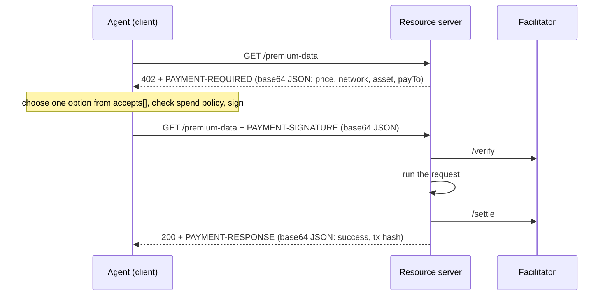

[x402](entry:x402) turns HTTP status `402 Payment Required` into a working payment loop. A server answers an unpaid request with its price, the client signs a payment and retries, and the server returns the resource along with a settlement receipt. There is no account, API key or checkout page, which is why it fits agents: the agent can pay for a call in the middle of a task.

This guide is for the **buyer** side, meaning an agent that pays. It targets **x402 protocol version 2**, which is what the current SDKs speak.

## What changed recently

- **Governance.** The canonical repository is now [x402-foundation/x402](https://github.com/x402-foundation/x402). `coinbase/x402` is a development fork. On July 14, 2026 the Linux Foundation announced the operational launch of the x402 Foundation, with the protocol contributed by Coinbase and 40 member organizations, including Coinbase, Cloudflare, Google, Stripe, Visa, Mastercard, AWS, Circle and Shopify.
- **Protocol v2** (spec dated December 2025) replaced the v1 headers and network names. If you find v1 code online, it will not talk to a v2 server without changes:

| Aspect | v1 | v2 |
|---|---|---|
| Payment header (client to server) | `X-PAYMENT` | `PAYMENT-SIGNATURE` |
| Receipt header (server to client) | `X-PAYMENT-RESPONSE` | `PAYMENT-RESPONSE` |
| Network names | `base-sepolia` | CAIP-2, e.g. `eip155:84532` |
| Version field | `x402Version: 1` | `x402Version: 2` |
| JS packages | `x402`, `x402-axios`, `x402-express` | `@x402/core`, `@x402/fetch`, `@x402/axios`, `@x402/evm`, ... |

## How the loop works

There are three parties: the **resource server** (the API), the **client** (your agent) and a **facilitator** that verifies and settles payments onchain for the server. Your agent never talks to the facilitator directly.



That is the default `authorization` flow: verify, run the resource, settle, respond. Schemes can also declare `upfront` (settle first) or `escrow` flows. When they do, the server must state it in `accepts[].extra.paymentFlow`.

### The 402 response

The price travels in the `PAYMENT-REQUIRED` header as base64-encoded JSON. Decoded, it looks like this example from the spec:

```json
{
  "x402Version": 2,
  "error": "PAYMENT-SIGNATURE header is required",
  "resource": {
    "url": "https://api.example.com/premium-data",
    "description": "Access to premium market data",
    "mimeType": "application/json"
  },
  "accepts": [
    {
      "scheme": "exact",
      "network": "eip155:84532",
      "amount": "10000",
      "asset": "0x036CbD53842c5426634e7929541eC2318f3dCF7e",
      "payTo": "0x209693Bc6afc0C5328bA36FaF03C514EF312287C",
      "maxTimeoutSeconds": 60,
      "extra": { "name": "USDC", "version": "2" }
    }
  ]
}
```

What an agent needs to read:

- `accepts` is a menu, and you pick one entry. `network` uses CAIP-2 (`eip155:8453` is Base, `eip155:84532` is Base Sepolia).
- `amount` is in **atomic units** of `asset`. USDC has 6 decimals, so `10000` means $0.01 and `1000000` means $1.00.
- `asset` is the token contract. The example address is USDC on Base Sepolia. USDC on Base mainnet is `0x833589fCD6eDb6E08f4c7C32D4f71b54bdA02913`.
- `scheme` sets how much you authorize. `exact` is a fixed price. `upto` authorizes a maximum, and the seller charges actual usage. `batch-settlement` deposits into escrow and signs offchain vouchers that the seller claims in batches.

You can inspect any endpoint by hand before you wire up a client:

```bash
curl -s -D - -o /dev/null https://api.example.com/premium-data \
  | grep -i '^payment-required:' | cut -d' ' -f2 | tr -d '\r' | base64 -d | jq .
```

### The paid retry and the receipt

The client retries the same request with a `PAYMENT-SIGNATURE` header: base64 JSON holding the chosen `accepted` requirement and a scheme-specific `payload`. For `exact` on EVM, that payload is an EIP-712 signature over an EIP-3009 `transferWithAuthorization` with `from`, `to`, `value`, `validAfter`, `validBefore` and a 32-byte `nonce`. Signing an authorization moves no money by itself. The facilitator submits it onchain at settlement, and the nonce and validity window prevent replay.

On success the server returns `200` with a `PAYMENT-RESPONSE` header such as `{"success": true, "transaction": "0x...", "network": "eip155:84532", "payer": "0x..."}`. A failed settlement returns `402` with `success: false` and an `errorReason` such as `insufficient_funds`. Invalid payloads get `400`.

## Option A: pay from code with the official SDKs

Install the client packages (TypeScript shown; Python is `pip install "x402[httpx]"` or `"x402[requests]"`, and Go is `go get github.com/x402-foundation/x402/go/v2`):

```bash
npm install @x402/fetch @x402/core @x402/evm viem
```

Wrap `fetch` so that 402 responses are handled automatically:

```typescript
import { wrapFetchWithPayment, x402HTTPClient } from "@x402/fetch";
import { x402Client } from "@x402/core/client";
import { ExactEvmScheme } from "@x402/evm/exact/client";
import { privateKeyToAccount } from "viem/accounts";

// A dedicated, low-balance key for the agent, never your main wallet.
const signer = privateKeyToAccount(process.env.EVM_PRIVATE_KEY as `0x${string}`);

const client = new x402Client();
client.register("eip155:*", new ExactEvmScheme(signer)); // any EVM network

const fetchWithPayment = wrapFetchWithPayment(fetch, client);
const httpClient = new x402HTTPClient(client);

const response = await fetchWithPayment("https://api.example.com/paid-endpoint");
const result = await httpClient.processResponse(response);

if (result.paymentStatus === "settled") console.log("Paid:", result.header);
else if (result.paymentStatus === "settle_failed") console.error("Settlement failed:", result.header);
```

The same pattern in Python with `httpx`:

```python
import asyncio, os
from eth_account import Account
from x402 import x402Client
from x402.http import x402HTTPClient
from x402.http.clients import x402HttpxClient
from x402.mechanisms.evm import EthAccountSigner
from x402.mechanisms.evm.exact.register import register_exact_evm_client

async def main() -> None:
    client = x402Client()
    register_exact_evm_client(client, EthAccountSigner(Account.from_key(os.environ["EVM_PRIVATE_KEY"])))
    async with x402HttpxClient(client) as http:
        response = await http.get("https://api.example.com/paid-endpoint")
        await response.aread()
        if response.is_success:
            print(x402HTTPClient(client).get_payment_settle_response(lambda n: response.headers.get(n)))

asyncio.run(main())
```

To pay on other chains, register more schemes, for example `client.register("solana:*", new ExactSvmScheme(svmSigner))` from `@x402/svm`. The quickstart also lists packages for Algorand, Aptos, Stellar, Hedera, NEAR, TON, XRPL, Keeta and Concordium.

### Spend controls: keep the default cap

By default the SDK client **pays only recognized USD-pegged assets such as USDC and caps each payment at $1**. These checks run before anything is signed. Raise the cap deliberately, never globally:

```typescript
const client = x402Client.fromConfig({
  schemes: [{ network: "eip155:*", client: new ExactEvmScheme(signer) }],
  spendControls: { maxAmountPerPayment: "$0.25" },
});
```

Setting `spendControls: false` removes every check, so don't do that in an autonomous agent. For a human approval step, use the `onBeforePaymentCreation` lifecycle hook. The per-payment cap does not limit total spend. Track cumulative spend in your own code, or fund the wallet with only what you are willing to lose.

## Option B: let the agent pay without writing code

- **[Coinbase Agentic Wallet](entry:coinbase-agentic-wallet)** has two modes. The MCP server (`npx @coinbase/payments-mcp`) works with MCP clients such as Claude, Codex and Gemini and can discover and pay for x402 services, but it cannot send or trade. The `awal` CLI plus [skills](entry:coinbase-agentic-wallet-skills) (`npx skills add coinbase/agentic-wallet-skills`) also sends and trades. Its pay command takes a ceiling in USDC atomic units:

```bash
npx awal@2.12.1 x402 pay https://example.com/api/data --max-amount 100000   # at most $0.10
```

- **[pay.sh](entry:pay-sh)** is a single-binary CLI that handles HTTP 402 for x402 and MPP.

## Find something to pay for: the Bazaar

Facilitators that support the Bazaar extension expose `GET {facilitator}/discovery/resources`, a machine-readable catalog of paid HTTP endpoints **and MCP tools** with prices and input/output schemas. The CDP endpoint is public:

```bash
curl -s "https://api.cdp.coinbase.com/platform/v2/x402/discovery/resources?limit=5" | jq '.items[] | {resource, accepts: [.accepts[] | {network, amount, scheme}]}'
```

The x402 docs call the Bazaar "early development", so treat its listings as leads and not as endorsements. See also [x402 Bazaar](entry:x402-bazaar).

## Paying for MCP tools

x402 v2 defines an MCP transport. A paid tool returns a normal tool result with `isError: true`, and the `PaymentRequired` object appears in both `structuredContent` and `content[0].text`. The client retries the same `tools/call` with the payment in `_meta["x402/payment"]`, and the receipt comes back in `_meta["x402/payment-response"]`. There is also an A2A transport, which [A2A x402](entry:a2a-x402) implements.

## Testnet first, then mainnet

1. Create a fresh EVM key for the agent. Fund it with Base Sepolia USDC from the [Circle faucet](https://faucet.circle.com).
2. Point the agent at a Base Sepolia endpoint (`eip155:84532`). The public `x402.org` facilitator is the SDK default for testnets and supports Base Sepolia, Solana Devnet, Stellar, Aptos, Hedera and XRPL testnets. The docs say it is not meant for mainnet.
3. For mainnet, the seller picks the facilitator. The [CDP facilitator](entry:cdp-x402) supports Base, Polygon, Arbitrum, World and Solana. It runs OFAC and KYT screening and charges sellers $0.001 per onchain transaction after 1,000 free per month. Verification is free. With EIP-3009 `exact` payments the facilitator submits the settlement transaction, so the buyer's wallet needs USDC but no ETH for gas.

## Safety checklist for autonomous payers

- Use a **separate wallet** holding a small float. Never give the agent the operator's main key.
- Keep the **per-payment cap** and add a **daily budget** in your own code.
- **Allowlist** networks and assets. The SDK default (USD stablecoins only) is a good baseline.
- **Log** every `PAYMENT-RESPONSE` (transaction hash, payer, amount) so a human can audit spend.
- Treat a 402 body as **untrusted input**. A malicious server can advertise any `payTo` and any price, so the cap is your real protection.
- Prefer `exact` for agents. With `upto` you authorize a ceiling, so set it no higher than you would pay.

## Alternatives

x402 is not the only HTTP-402 protocol. [L402](entry:l402) uses Lightning and macaroons, and the [Machine Payments Protocol](entry:machine-payments-protocol) is another agent payment standard. For a side-by-side view, see [Agent payment rails compared](comparison:agent-payment-rails).
